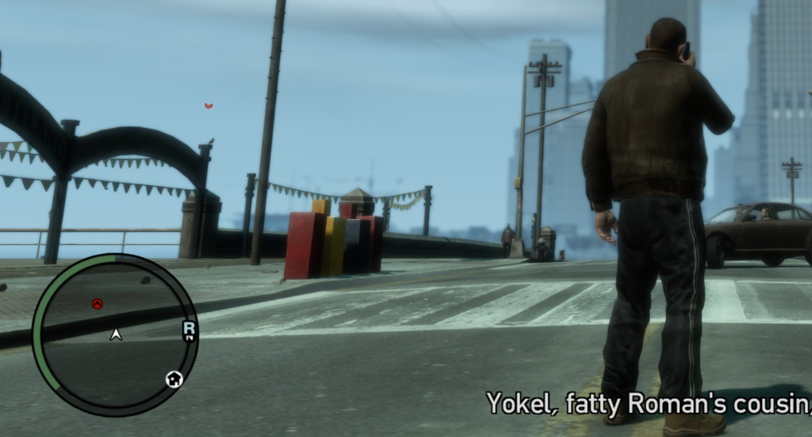

# Pigeons.IV

Pigeons.IV is a GTA IV and Episodes from Liberty City ASI plugin that displays nearby collectible birds on the radar. It supports the 200 pigeons in the base game and both sets of 50 seagulls in The Lost and Damned and The Ballad of Gay Tony.



## Credits and original work

This mod was made possible by the following projects and authors. Please credit them when redistributing this source or a derivative work.

### plugin-sdk

[plugin-sdk](https://github.com/DK22Pac/plugin-sdk) was created and maintained by DK22Pac and the plugin-sdk contributors, with work from the wider GTA modding community. Pigeons.IV uses its GTA IV plugin framework, game classes, event hooks, model information, radar definitions, native-script command bindings, configuration helper, and generated Visual Studio project structure.

The plugin-sdk contributors and original license remain credited in the parent repository's [README](https://github.com/DK22Pac/plugin-sdk#readme) and [LICENSE](https://github.com/DK22Pac/plugin-sdk/blob/master/LICENSE).

### GTA IV Pigeon Locator

[GTA IV Pigeon Locator](https://github.com/whampson/pigeon-locator) was created by **Wes Hampson (`whampson`)**. Its game-data tables provided the exact world coordinates used for:

- 200 GTA IV pigeons
- 50 The Lost and Damned seagulls
- 50 The Ballad of Gay Tony seagulls

Pigeon Locator is distributed under the [MIT License](https://github.com/whampson/pigeon-locator/blob/master/LICENSE). Its copyright and permission notice are retained in `source/PigeonLocations.h` and `source/SeagullLocations.h`.

### Rockstar Games

Grand Theft Auto IV, The Lost and Damned, The Ballad of Gay Tony, their world, models, names, and other game assets are property of Rockstar Games and their respective owners. This is an unofficial community modification and is not affiliated with or endorsed by Rockstar Games.

## Features

- Automatically detects the active game episode.
- Shows live, uncollected GTA IV pigeons on the radar.
- Shows live, uncollected TLAD or TBoGT seagulls using the correct episode-specific locations.
- Tracks multiple collectibles simultaneously instead of switching a single marker between targets.
- Uses red enemy-style radar dots.
- Offers an alternative nearest-target vibration mode with stronger, faster pulses as the player gets closer.
- Removes markers when a collectible is destroyed, unloaded, or leaves the configured radius.
- Allows a detection radius from 10 to 500 in-game metres.
- Provides optional diagnostic logging.

## How it works

The plugin checks known collectible coordinates near the player and asks the game whether the appropriate bird model currently exists at each location. A radar blip is created only when the object is present.

This approach does not parse save files. Detection depends on the game streaming the collectible object into the world, so very large configured distances may not always produce a marker at the full radius.

Scan and vibration timing use the game's `GET_GAME_TIMER` native to avoid the unused Plugin-SDK timer initialization that conflicts with FusionFix 5.1.x. Vibration pause flags are resolved separately with checked bindings; if they cannot be resolved safely, vibration hints are disabled and the reason is logged when logging is enabled.

## Installation

1. Install an ASI loader compatible with your GTA IV version.
2. Copy `Pigeons.IV.asi` and `Pigeons.IV.ini` into the game's `scripts` directory.
3. Start GTA IV, The Lost and Damned, or The Ballad of Gay Tony.

The plugin creates a default INI beside the ASI if the file is missing.

## Configuration

Edit `Pigeons.IV.ini` and restart the game after making changes:

```ini
; Pigeon/seagull radar detection radius in GTA IV world metres.
; Valid distance range: 10 to 500 metres.
Distance = 300.0

; Assist mode: 1 = multiple radar blips, 2 = vibration hints for the nearest collectible.
Variant = 1

; Set to 0 to disable Pigeons.IV.log writes, or 1 to enable them.
Logging = 1

; Set to 1 to show an arrow above each pigeon or seagull, or 0 for radar/map only.
ShowWorldArrow = 0
```

`Distance` values outside the valid range are clamped and saved back to the INI. `Variant = 1` preserves the original behavior and can display multiple collectible blips at once. `Variant = 2` creates no collectible blips; it selects the nearest currently detected bird and pulses the controller more strongly and frequently as the distance closes. It follows the game's vibration preference and pauses its hints while the game is paused or faded out.

Setting `Logging` to `0` prevents new log writes but does not delete an existing log file. `ShowWorldArrow` controls arrows for both GTA IV pigeons and TLAD/TBoGT seagulls and applies only to variant 1. The shared setting uses different internal rendering paths: pigeon arrows use the normal collectible blips, while seagull radar dots remain coordinate-based and their world arrows are attached directly to streamed seagull objects.

Variant 2 uses these built-in distance bands:

| Distance | Hint pattern |
| --- | --- |
| Up to 25 m | Strongest, fastest pulse |
| 25-50 m | Very strong, fast pulse |
| 50-100 m | Strong, medium pulse |
| 100-200 m | Moderate, slow pulse |
| Over 200 m | Weakest, slowest pulse |

## Supported collectibles

| Game episode | Collectible | Total |
| --- | --- | ---: |
| Grand Theft Auto IV | Pigeons | 200 |
| The Lost and Damned | Seagulls | 50 |
| The Ballad of Gay Tony | Seagulls | 50 |

Only the locations belonging to the currently active episode are scanned.

## Building

The project is intended to be built inside the plugin-sdk checkout:

1. Open `Pigeons.sln` in Visual Studio 2022.
2. Select `Release GTA4` and `Win32`.
3. Build the `Pigeons` project.

The release artifact is written to:

```text
bin/GTA4/Release/Pigeons.IV.asi
```

The default INI is copied into the same output directory without overwriting an existing customized file.

## Third-party licensing

Third-party code and data remain subject to their original licenses. Nothing in this project removes or replaces the attribution and license requirements of plugin-sdk or GTA IV Pigeon Locator.
